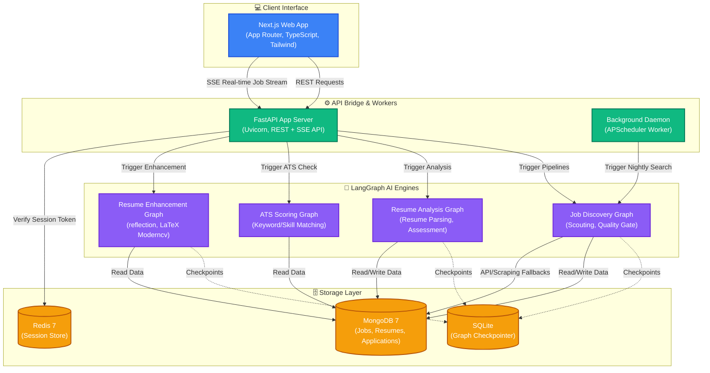
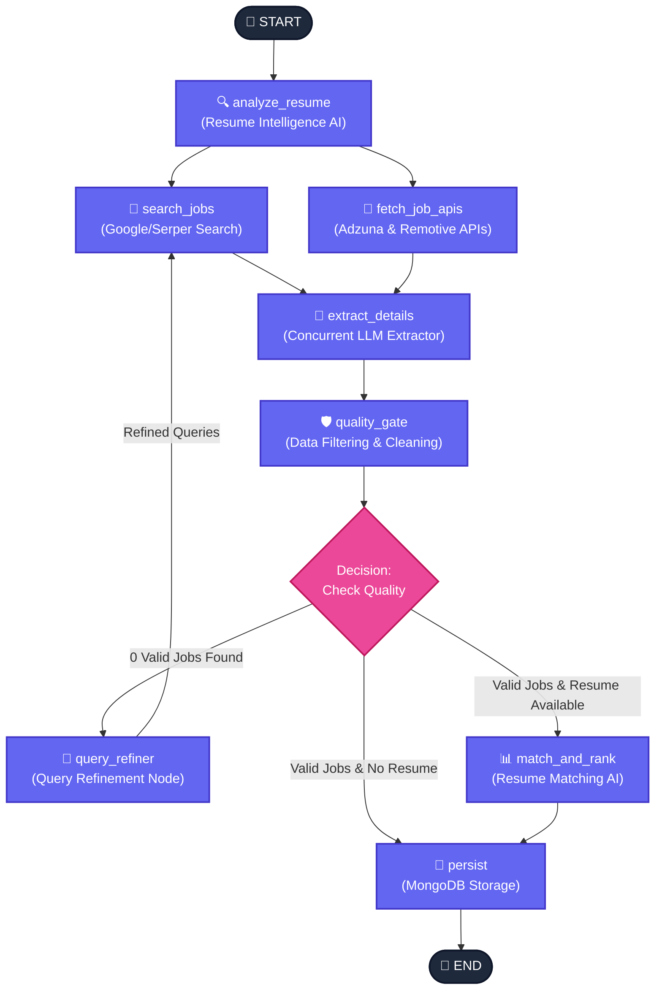

<p align="center">
  <h1 align="center">🚀 JobFlow AI</h1>
  <p align="center">
    <strong>An AI-Powered Career Command Center built with LangGraph</strong>
  </p>
  <p align="center">
    Autonomous job discovery · Resume analysis · ATS scoring · AI-enhanced resumes · One-click auto-apply
  </p>
  <p align="center">
    <a href="#-features">Features</a> •
    <a href="#%EF%B8%8F-architecture">Architecture</a> •
    <a href="#-quick-start">Quick Start</a> •
    <a href="#-api-reference">API</a> •
    <a href="#-tech-stack">Tech Stack</a> •
    <a href="#-license">License</a>
  </p>
</p>

---

## ✨ Features

| Feature | Description |
|---------|-------------|
| **🔬 Resume Analysis** | LangGraph pipeline parses, evaluates, and scores your resume with structured career assessment |
| **🎯 Smart Job Discovery** | Resume-aware agent generates tailored search queries, scrapes 50+ ATS platforms, and filters with a Quality Gate |
| **📊 ATS Score Check** | Real-time ATS compatibility scoring against any job description with keyword matching |
| **✨ Resume Enhancement** | AI-powered resume rewriting tailored to specific JDs with gap analysis, including LaTeX/Overleaf export |
| **🤖 Auto-Apply (RPA)** | Headless Playwright automation fills Lever and Greenhouse application forms |
| **📡 Real-Time SSE Streaming** | Jobs are scored and streamed to the frontend in real-time as they're discovered |
| **📋 Application Tracker** | Kanban-style board to track job application statuses |
| **🔄 Self-Correcting Pipelines** | Cyclic reflection loops retry and refine search queries when zero results are found |
| **📄 PDF Report Generation** | Professionally styled PDF reports with fit scores, skill gaps, and strategic recommendations |

<br>

## 🏗️ Architecture

### System Architecture


### LangGraph Pipeline: Job Discovery



<br>

## 🚀 Quick Start

### Prerequisites

| Tool | Version |
|------|---------|
| Python | 3.10 – 3.12 |
| Node.js | ≥ 20 |
| [uv](https://docs.astral.sh/uv/) | latest |
| MongoDB | 7+ |
| Redis | 7+ (optional — falls back to in-memory) |

### 1. Clone and configure

```bash
git clone https://github.com/your-username/jobflow-ai.git
cd jobflow-ai
```

Create `.env` in the project root:

```env
# Required
DEEPSEEK_API_KEY=sk-...
GOOGLE_API_KEY=AIza...
SERPER_API_KEY=...
MONGODB_URI=mongodb://localhost:27017/jobflow

# Optional
REDIS_URL=redis://localhost:6379/0
LANGCHAIN_TRACING_V2=true
LANGCHAIN_API_KEY=lsv2_...
```

### 2. Install dependencies

```bash
# Python backend
uv sync

# Next.js frontend
cd webapp
npm install
```

### 3. Start services

**Option A — Docker Compose (recommended)**

```bash
docker compose up -d
```

This starts MongoDB, Redis, the FastAPI backend, and the Next.js frontend.

**Option B — Local development**

```powershell
# From project root:
.\start.ps1
```

Or manually:

```bash
# Terminal 1: FastAPI backend
uv run uvicorn api.server:app --reload --port 8000

# Terminal 2: Next.js frontend
cd webapp
npm run dev
```

### 4. Open the app

- **Frontend**: [http://localhost:3000](http://localhost:3000)
- **API Docs**: [http://localhost:8000/docs](http://localhost:8000/docs)
- **Health Check**: [http://localhost:8000/health](http://localhost:8000/health)

<br>

## 📡 API Reference

| Method | Endpoint | Description |
|--------|----------|-------------|
| `GET` | `/health` | Basic health check |
| `GET` | `/health/detailed` | MongoDB + Redis connectivity check |
| `POST` | `/init-session` | Store resume text, returns session ID (TTL: 4h) |
| `GET` | `/session/{id}/status` | Check if a resume session is still alive |
| `POST` | `/analyze-resume` | Run the Resume Analysis LangGraph pipeline |
| `POST` | `/search-jobs` | Run Job Discovery pipeline (blocking) |
| `GET` | `/stream-matches` | SSE stream of scored job matches |
| `POST` | `/ats-score` | ATS compatibility scoring |
| `POST` | `/enhance-resume` | AI resume rewriting + LaTeX generation |
| `POST` | `/auto-apply` | RPA auto-fill for Lever/Greenhouse forms |
| `POST` | `/parse-pdf` | Extract text from uploaded PDF |
| `POST` | `/parse-docx` | Extract text from uploaded DOCX |
| `GET` | `/download-resume` | Download the most recently enhanced resume |

<br>

## 🛠 Tech Stack

### Backend
- **LangGraph** — Stateful AI pipeline orchestration with cyclic reflection loops
- **LangChain** — LLM abstraction layer (DeepSeek Chat + Gemini 2.5 Flash)
- **FastAPI** — High-performance async REST + SSE server
- **MongoDB (Motor)** — Async document storage for jobs, resumes, applications
- **Redis** — Session store with TTL (4-hour resume sessions)
- **SQLite** — LangGraph state checkpointing for fault recovery
- **Playwright** — Headless browser automation for auto-apply RPA
- **LangSmith** — Observability and tracing (optional)

### Frontend
- **Next.js 16** — React framework with App Router
- **TypeScript** — Type-safe component development
- **Tailwind CSS v4** — Utility-first styling
- **SSE (EventSource)** — Real-time job streaming

### AI Models
| Model | Provider | Usage |
|-------|----------|-------|
| DeepSeek Chat | DeepSeek | Search queries, extraction, parsing, quality gate |
| Gemini 2.5 Flash | Google | Scoring, assessment, resume enhancement |

### Infrastructure
- **Docker Compose** — Multi-service orchestration (API + webapp + MongoDB + Redis)
- **GitHub Actions CI** — Automated Python tests + frontend build verification
- **uv** — Fast Python package management with lockfile

<br>

## 📁 Project Structure

```
.
├── docker-compose.yml           # Full-stack Docker orchestration
├── .github/workflows/ci.yml     # GitHub Actions CI workflow
├── pyproject.toml               # Python project configuration
├── uv.lock                      # Python dependency lockfile
│
├── api/                         # FastAPI REST Server
│   ├── server.py                # REST routes and SSE endpoints
│   ├── db.py                    # MongoDB + Redis data layers
│   ├── config.py                # Pydantic environment configuration
│   ├── auto_apply.py            # Playwright automation (Lever/Greenhouse)
│   └── background_scout.py      # Background daemon cycle runner
│
├── src/job_scraper/             # Core Python Package
│   ├── graphs/                  # LangGraph StateGraph Pipelines
│   │   ├── job_discovery.py     # Job Scouting, filtering and Query Reflection
│   │   ├── resume_analysis.py   # Parsing and Skills Assessment
│   │   ├── ats_scoring.py       # ATS compatibility analyzer
│   │   ├── resume_enhancement.py# Reflection rewrites and gap analysis
│   │   ├── user_matching.py     # Real-time SSE streaming coordinator
│   │   ├── state.py             # TypedDict state definitions
│   │   ├── tools.py             # Google Serper and Web Scraper tools
│   │   ├── llm_factory.py       # Centralized LLM selection
│   │   ├── error_handling.py    # Robust structured output retry engines
│   │   └── tracing.py           # Structured logging and tracing decorators
│   │
│   ├── tools/                   # Output Generation Tools
│   │   ├── latex_resume_tool.py    # Markdown-to-LaTeX (moderncv style) compiler
│   │   └── resume_document_tool.py # Markdown-to-PDF / DOCX exporter
│   │
│   ├── models.py                # Pydantic schema models
│   ├── report_generator.py      # PDF Career Assessment renderer
│   └── main.py                  # CLI entry point
│
├── webapp/                      # Next.js 16 Web Application
│   ├── src/app/                 # App Router pages (jobs, analyze, tracker)
│   └── src/components/          # Reusable React components (ATS Score Gauge)
│
├── knowledge/                   # Target resume & user search preferences
├── tests/                       # Complete Pytest test suite
└── docs/                        # Architectural strategies and reports
```

<br>

## 🧪 Testing

```bash
# Run the full test suite
uv run pytest -v

# Run a quick smoke test of all graph pipelines
uv run test
```

<br>

## 🐳 Docker

```bash
# Build and start all services
docker compose up -d

# View logs
docker compose logs -f api

# Rebuild after code changes
docker compose up -d --build
```

Services:
| Service | Port | Container |
|---------|------|-----------|
| FastAPI API | 8000 | `jobflow-api` |
| Next.js App | 3000 | `jobflow-webapp` |
| MongoDB 7 | 27017 | `jobflow-mongo` |
| Redis 7 | 6379 | `jobflow-redis` |

<br>

## 🔑 Environment Variables

| Variable | Required | Description |
|----------|----------|-------------|
| `DEEPSEEK_API_KEY` | ✅ | DeepSeek API key for search/extraction |
| `GOOGLE_API_KEY` | ✅ | Google AI API key for Gemini Flash |
| `SERPER_API_KEY` | ✅ | Serper.dev API key for Google search |
| `MONGODB_URI` | ✅ | MongoDB connection string |
| `REDIS_URL` | ❌ | Redis URL (defaults to `redis://localhost:6379/0`) |
| `LANGCHAIN_TRACING_V2` | ❌ | Enable LangSmith tracing (`true`) |
| `LANGCHAIN_API_KEY` | ❌ | LangSmith API key |
| `OPENAI_API_KEY` | ❌ | OpenAI key (optional, for future use) |

<br>

## 📋 CLI Commands

```bash
uv run job_scraper       # Run full job discovery pipeline
uv run test              # Smoke test all graph pipelines
uv run generate_report   # Convert markdown report to styled PDF
uv run run_with_trigger  # Run discovery with JSON trigger payload
```


## 📄 License

Copyright © 2026 Aryan Nishen. This project is for personal/portfolio use. All rights reserved.

---

<p align="center">
  Built with ❤️ using <strong>LangGraph</strong> · <strong>DeepSeek</strong> · <strong>Gemini</strong> · <strong>FastAPI</strong> · <strong>Next.js</strong>
</p>
